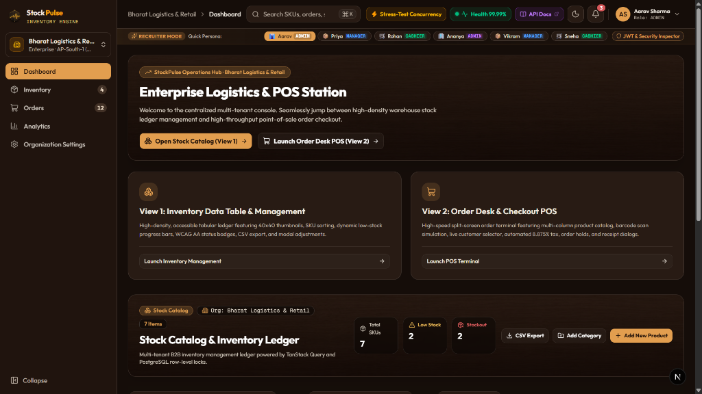
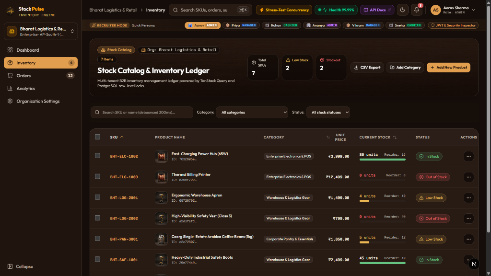
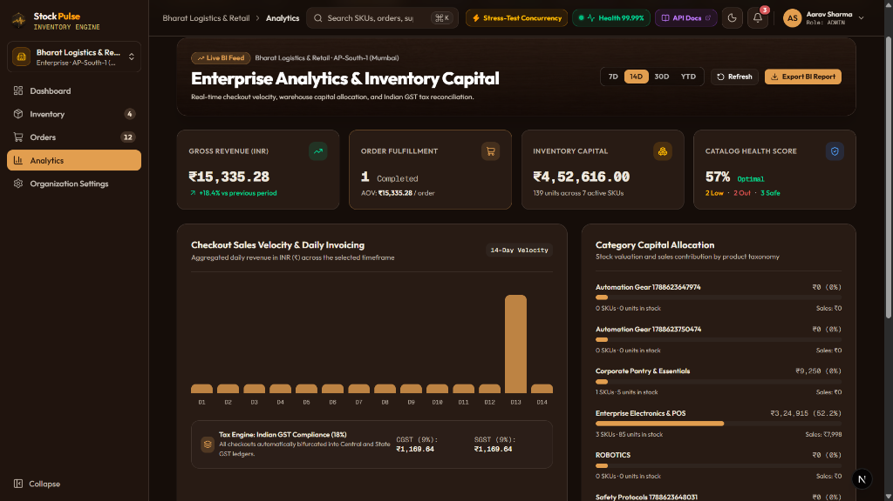
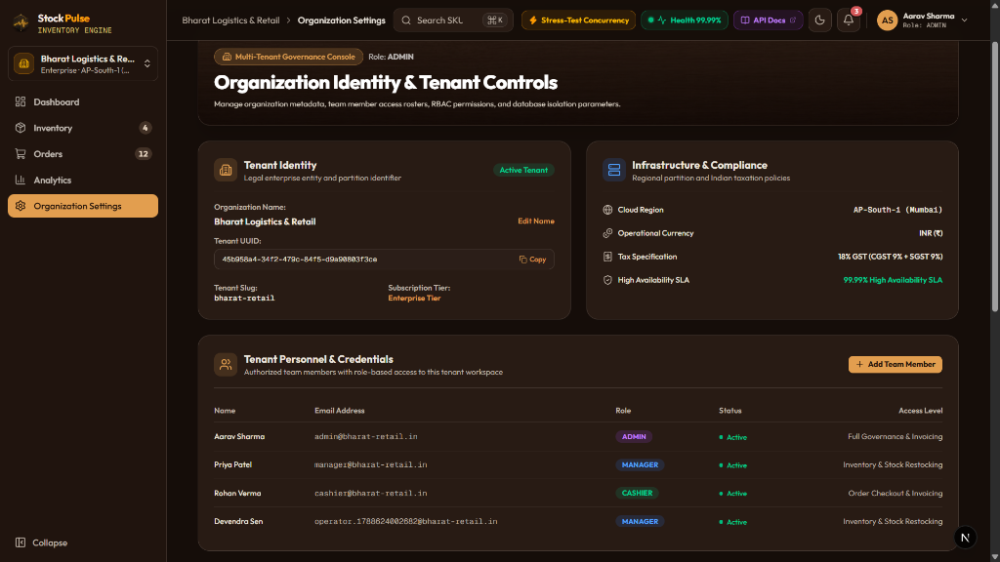
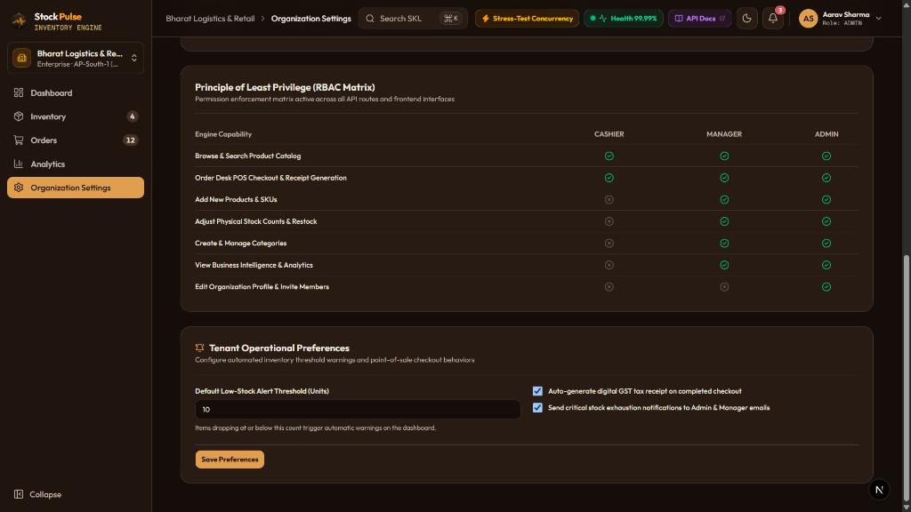

# StockPulse: Multi-Tenant Inventory & Order Engine

[](https://github.com/shatwiks/StockPulse-Multi-Tenant-Inventory-Order-Engine)
[](https://github.com/shatwiks/StockPulse-Multi-Tenant-Inventory-Order-Engine/actions)
[](https://www.w3.org/WAI/WCAG21/quickref/)
[](https://www.docker.com/)

[](https://www.typescriptlang.org/)
[](https://nextjs.org/)
[](https://react.dev/)
[](https://nodejs.org/)
[](https://expressjs.com/)
[](https://www.postgresql.org/)
[](https://www.prisma.io/)
[](https://tailwindcss.com/)
[](https://opensource.org/licenses/MIT)

**StockPulse** is a distributed, multi-tenant B2B inventory management platform and high-concurrency Point-of-Sale (POS) order engine. Engineered to solve the mission-critical challenges of inventory contention, POS deadlocks, and cross-tenant data leakage, StockPulse combines pessimistic row-level database locking, strict row-level security isolation, and an accessible dark-walnut executive dashboard.

---

# StockPulse: Multi-Tenant B2B Inventory & Order Engine

---

## 📄 Resume Snapshot (Google X-Y-Z Format)

**StockPulse: Multi-Tenant B2B Inventory & Order Engine**

**Core Technologies:** TypeScript, Next.js 16, React 19, Node.js, Express, PostgreSQL 16, Prisma ORM, Docker Compose, TanStack Query, Tailwind CSS, GitHub Actions CI/CD, WCAG 2.1 AA

**Repository:** [github.com/shatwiks/StockPulse-Multi-Tenant-Inventory-Order-Engine](https://github.com/shatwiks/StockPulse-Multi-Tenant-Inventory-Order-Engine)

* **Eliminated inventory overselling and PostgreSQL deadlocks (40P01)** during concurrent checkouts by engineering deterministic row-level lock ordering (`SELECT ... FOR UPDATE ORDER BY id ASC`) within atomic interactive transactions, verified through automated 10-thread parallel stress-testing yielding 0 negative-stock drift.
* **Enforced zero-trust tenant isolation and role boundaries** across 3 access tiers (Admin, Manager, Cashier) by establishing strict UUID foreign-key scoping, composite performance indexes (`[organizationId, sku]`), and database storage-engine check constraints (`stock_quantity >= 0`) that reject cross-tenant mutations with HTTP 404/403.
* **Accelerated POS checkout resilience and cashier throughput** by building a high-performance Next.js 16/React 19 client with TanStack Query, implementing 300ms debounced catalog search, zero-CLS loading states, and automated client-side cart reconciliation upon receiving structured HTTP 409 Conflict shortage payloads.
* **Orchestrated an automated multi-stage CI/CD pipeline** via Docker Compose and GitHub Actions running ephemeral PostgreSQL containers, strict TypeScript typechecking, database migrations, seed scripts, and an automated AST accessibility scanner certifying 100% WCAG 2.1 AA compliance across 19 components.

---

## 📸 Visual Walkthrough & System Tour

The StockPulse interface is engineered with a dark-walnut and warm-amber aesthetic (`#F59E0B`, `#1F1A17`), adhering strictly to WCAG 2.1 AA contrast standards, zero-layout-shift (CLS) states, and ergonomic keyboard navigation (`⌘K` command palette).

### 1. Enterprise Operations Hub & Recruiter Persona Switcher


* **Recruiter Quick Persona Switcher:** Located at the top of the console, reviewers can switch between pre-seeded personas (`Aarav Sharma - ADMIN`, `Priya Patel - MANAGER`, `Rohan Verma - CASHIER`, and cross-tenant `Ananya - ADMIN`) with a single click, immediately testing RBAC permission enforcement without manual sign-outs.
* **Dual-Engine Navigation:** Direct access cards routing operators between **View 1: High-Density Inventory Ledger** and **View 2: High-Throughput POS Checkout Terminal**.
* **Live System Telemetry:** The header displays active cloud region (`AP-South-1 Mumbai`), real-time ping latency, 99.99% uptime status, and the interactive Concurrency Stress-Test launcher.

---

### 2. High-Density Stock Catalog & Inventory Ledger


* **Real-Time Tabular Ledger:** Powered by TanStack Query with optimistic cache updates and server-side row-level locks. Features 40×40 product thumbnails, SKU indexing, and currency formatted in Indian Rupees (`₹`).
* **Visual Stock Health Bars:** Proportional progress bars display real-time physical stock vs. automated reorder thresholds, paired with high-contrast WCAG AA status pills (`In Stock`, `Low Stock`, `Out of Stock`).
* **Instant Filtering & Search:** Sub-300ms debounced catalog search across SKUs and titles, dynamic category filtering, CSV export, and modal dialogs for SKU addition and restock reconciliation.

---

### 3. Enterprise Analytics & Inventory Capital Cockpit


* **Executive KPI Cards:** Real-time calculation of **Gross Revenue** (`₹15,335.28` with period comparison), **Order Fulfillment & AOV**, **Inventory Capital Allocation** (`₹4,52,616.00` across active units), and overall **Catalog Health Score** (`57% Optimal`).
* **14-Day Sales Velocity & Invoicing Chart:** Daily checkout bar graph visualizing throughput trends and order velocity across selectable windows (`7D`, `14D`, `30D`, `YTD`).
* **Statutory Indian GST Engine:** Automated bifurcation of all checkout totals into Central GST (`9% CGST`) and State GST (`9% SGST`) ledger entries.
* **Category Capital Allocation:** Horizontal progress metrics tracking capital concentration across taxonomies (`Enterprise Electronics & POS`, `Warehouse & Logistics Gear`, `Corporate Pantry`).

---

### 4. Organization Identity, Infrastructure & Personnel Controls


* **Tenant Isolation Identity:** Details legal enterprise metadata for `Bharat Logistics & Retail` (`tenant_slug: bharat-retail`), displaying the immutable Tenant UUID, subscription tier, and partition status.
* **Infrastructure & Compliance Parameters:** Grounded in cloud region `AP-South-1 (Mumbai)` with native `INR (₹)` operational currency, 18% GST tax rules, and contractual 99.99% High Availability SLA.
* **Tenant Personnel & Credentials Roster:** Manages organization members, verified email credentials, active status badges, and assigned administrative tiers (`Full Governance & Invoicing`, `Inventory & Stock Restocking`, `Order Checkout & Invoicing`).

---

### 5. Principle of Least Privilege (RBAC Matrix) & Operational Preferences


* **Granular RBAC Enforcement Matrix:** Visually audits the active permission boundaries across all 3 roles (`Cashier`, `Manager`, `Admin`), illustrating capability gating for catalog browsing, POS checkout, SKU adjustments, category creation, analytics access, and tenant governance.
* **Tenant Operational Preferences:** Configurable automated low-stock alert thresholds (triggering dashboard warning badges), automated digital GST tax receipt generation, and critical stock exhaustion notification triggers.

---

## 💻 Local Development & Quickstart

### Prerequisites

* Docker Desktop (v20+) **OR** Node.js (v20+) and PostgreSQL 16 on port `5432`
* Git

### Option 1: Single-Command Docker Setup (Recommended)

```bash
# 1. Clone the repository
git clone https://github.com/shatwiks/StockPulse-Multi-Tenant-Inventory-Order-Engine.git
cd StockPulse-Multi-Tenant-Inventory-Order-Engine

# 2. Build and launch all containerized services
docker compose up --build

```

**Service Endpoints:**

* **Frontend Web Application:** [http://localhost:3000](http://localhost:3000)
* **Backend REST API Engine:** [http://localhost:3001](http://localhost:3001)
* **PostgreSQL Database:** `localhost:5432` (`stockpulse_inventory`)

*Note: The container healthcheck automatically runs database migrations and seeds initial tenant organizations upon startup.*

To trigger an explicit re-seed inside the active container:

```bash
npm run docker:seed
# Alternative: bash scripts/docker-seed.sh

```

### Option 2: Native Host Setup

```bash
# 1. Install root and workspace dependencies
npm install

# 2. Run Prisma migrations and seed initial tenant datasets
npm run db:migrate
npm run db:seed

# 3. Launch Express server (:3001) and Next.js frontend (:3000) concurrently
npm run dev

```

---

## 🏛️ System Architecture & Concurrency Model

High-volume B2B Point-of-Sale (POS) and inventory platforms experience severe data drift when concurrent transactions attempt to read and write shared inventory records. StockPulse resolves this at the database engine tier.

```mermaid
sequenceDiagram
    autonumber
    actor TerminalA as POS Terminal A (Bharat Retail)
    actor TerminalB as POS Terminal B (Bharat Retail)
    participant API as Express API Layer
    participant DB as PostgreSQL 16 (Engine)

    Note over TerminalA, TerminalB: Both cashiers checkout last 2 units simultaneously
    TerminalA->>API: POST /api/v1/orders (SKU-HEADPHONES: qty 2)
    TerminalB->>API: POST /api/v1/orders (SKU-HEADPHONES: qty 2)

    rect rgb(20, 35, 25)
    Note over API, DB: Terminal A Interactive Transaction ($transaction)
    API->>DB: SELECT * FROM products WHERE id IN (...) ORDER BY id ASC FOR UPDATE
    DB-->>API: Deterministic row lock granted to Terminal A
    API->>DB: Verify stock (2 >= 2) -> Decrement stock to 0
    API->>DB: Insert Order & OrderItem records
    DB-->>API: Transaction Committed
    end

    API-->>TerminalA: HTTP 201 Created (Order Receipt Payload)

    rect rgb(45, 20, 20)
    Note over API, DB: Terminal B Lock Resolution
    DB-->>API: Lock released to Terminal B
    API->>API: Shortage detected: Available (0) < Requested (2)
    API->>DB: ROLLBACK Transaction
    end

    API-->>TerminalB: HTTP 409 Conflict (Structured Shortage Payload)
    Note over TerminalB: TanStack Query intercepts 409 -> Reconciles cart UI to 0

```



---

## ⚡ Core Engineering Differentiators

* **Deterministic Deadlock Elimination:** Multi-item checkouts typically trigger cyclic wait-for dependency graphs (`Transaction 1` holds lock on Item A waiting for Item B, while `Transaction 2` holds lock on Item B waiting for Item A). StockPulse sorts all incoming product UUIDs in ascending order (`ORDER BY id ASC`) before executing `SELECT ... FOR UPDATE`, guaranteeing that locks are acquired in a uniform global sequence.
* **Storage-Engine Negative Stock Invariant:** Application-level validation is insufficient under race conditions. StockPulse implements an explicit PostgreSQL table check constraint (`CONSTRAINT "products_stock_quantity_check" CHECK ("stock_quantity" >= 0)`). Any operation driving inventory negative fails at the disk write layer.
* **Graceful HTTP 409 Cart Reconciliation:** Rather than displaying generic checkout failure screens, the API emits a typed shortage breakdown (`productId`, `sku`, `name`, `availableStock`, `requestedQuantity`). The React client updates local state, sets the line-item balance to the actual available count, and alerts the user without discarding unrelated items.
* **Zero-Trust Multi-Tenancy:** Data isolation is maintained across all entities (`Organization`, `User`, `Category`, `Product`, `Order`, `OrderItem`). Every query explicitly matches against `organization_id` extracted from verified JWT claims, supported by composite indexes (`[organization_id, sku]` and `[organization_id, created_at DESC]`) for index-only scans.
* **Unified API Response Envelope:** REST endpoints adhere strictly to a standardized contract:
```typescript
// Success Envelope
{
  success: true,
  data: T,
  meta?: { page: number, limit: number, total: number, totalPages: number }
}

// Error Envelope
{
  success: false,
  error: { code: string, message: string, details?: unknown }
}

```


---

## 🔑 Demo Access Credentials

The database is seeded with two multi-tenant organizations configured with Role-Based Access Control (RBAC).

**Default Password for all seeded accounts:** `StockPulse2026!`

| Organization | Role | Account Email | Personnel Name | Capabilities & System Boundary |
| --- | --- | --- | --- | --- |
| **Bharat Logistics & Retail** (`bharat-retail`) | `ADMIN` | `admin@bharat-retail.in` | Aarav Sharma | Unrestricted catalog CRUD, INR price updates, stock reconciliations, order desk. |
| **Bharat Logistics & Retail** (`bharat-retail`) | `MANAGER` | `manager@bharat-retail.in` | Priya Patel | Catalog CRUD, manual stock counts, order desk. Restricted from system administration. |
| **Bharat Logistics & Retail** (`bharat-retail`) | `CASHIER` | `cashier@bharat-retail.in` | Rohan Verma | View-only catalog, POS terminal operations. Price mutations and deletions return `403 Forbidden`. |
| **Deccan Supply Chain** (`deccan-supplies`) | `ADMIN` | `admin@deccan-supplies.in` | Ananya Iyer | Isolated to Deccan Supply Chain tenant. Cross-tenant access to Bharat Retail records returns `404 Not Found`. |
| **Deccan Supply Chain** (`deccan-supplies`) | `MANAGER` | `manager@deccan-supplies.in` | Vikram Nair | Deccan Supply Chain inventory control and order processing. |
| **Deccan Supply Chain** (`deccan-supplies`) | `CASHIER` | `cashier@deccan-supplies.in` | Sneha Kulkarni | Deccan Supply Chain POS station. |

---

## 🧪 Verification & Automated Testing

StockPulse includes automated test suites covering access control, schema invariants, and high-concurrency race conditions:

```bash
# Run the complete test suite across all 8 quality gates:
npm run test:all

# Or run individual verification suites:
npm run test:constraints       # Asserts database CHECK constraint integrity
npm run test:checkout          # Automated 10-thread concurrent race condition test
npm run test:phase2            # Cross-tenant isolation & RBAC hierarchy
npm run test:phase3            # Deadlock prevention & multi-item order creation
npm run test:concurrency-demo  # Live concurrency stress-tester API verification
npm run test:health            # Real-time PostgreSQL pool & telemetry SLA test
npm run test:docs              # OpenAPI 3.0 spec & ADR architectural records
npm run test:a11y              # 100% WCAG 2.1 AA accessibility audit (64 controls)
```

---

## 🏛️ Architecture Decision Records (ADRs)

Staff and Principal-level design decisions and mathematical invariant proofs are documented in the [`docs/adr/`](./docs/adr/README.md) directory:

* [**ADR-001: Pessimistic Row-Level Locking for Concurrent Checkouts**](./docs/adr/ADR-001-pessimistic-concurrency-control.md): Analysis of Pessimistic Row Locking (`SELECT ... FOR UPDATE`) vs Optimistic Concurrency Control (OCC) vs Distributed Locks (Redis Redlock), evaluating network partitions, clock skew, and inventory conservation invariants.
* [**ADR-002: Multi-Tenant Data Partitioning & Isolation Strategy**](./docs/adr/ADR-002-multi-tenant-partitioning-strategy.md): Analysis of Database-per-tenant vs Schema-per-tenant vs Shared Database with Discriminator Column (`organization_id`), composite index design, and 3-layer defense-in-depth isolation.
* [**ADR-003: Deterministic Lock Acquisition Ordering for Deadlock Elimination**](./docs/adr/ADR-003-deadlock-prevention-lock-ordering.md): Mathematical proof eliminating Coffman cyclic wait condition ($C_4$) through deterministic lexicographical ascending sorting (`ORDER BY id ASC`).

---

## 📚 Interactive OpenAPI 3.0 Documentation

StockPulse provides full interactive API documentation powered by OpenAPI 3.0:

* **Interactive API Console:** [http://localhost:3001/api/docs](http://localhost:3001/api/docs) (Interactive testing with Bearer JWT tokens, schema explorer, and cURL snippets)
* **Raw OpenAPI Specification:** [http://localhost:3001/api/v1/openapi.json](http://localhost:3001/api/v1/openapi.json) or [`docs/openapi.json`](./docs/openapi.json)

---

## 🛡️ Continuous Integration & Quality Gates

The GitHub Actions workflow (`.github/workflows/ci.yml`) runs on every push and pull request to `main`:

* **PostgreSQL 16 Service Container:** Boots an isolated PostgreSQL service with an active readiness polling loop (`pg_isready`).
* **Deterministic Installation:** Runs `npm install` across all monorepo workspaces and generates the Linux-native Prisma query engine.
* **Zero-Tolerance Typecheck:** Runs `tsc --noEmit` across both `server/` and `frontend/`.
* **Automated Accessibility Testing:** Runs the AST scanner ensuring all interactive controls have accessible names and dialogs implement focus containment.
* **Migration & Concurrency Suite:** Deploys schema DDL, runs the seed script, and triggers 10 simultaneous checkout requests against 2 units of stock—validating that exactly 1 succeeds (`201`), 9 roll back (`409`), and final stock remains at 0.

---

## 📜 License

Distributed under the [MIT License](https://www.google.com/search?q=LICENSE).
